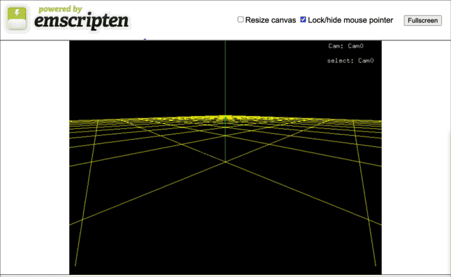

# vim3d.js - Emscripten port

- [vim3d.js - Emscripten port](#vim3djs---emscripten-port)
  - [Demo](#demo)
  - [Development](#development)
    - [Requirements](#requirements)
  - [Building the project](#building-the-project)
  - [Run](#run)
- [Notes on Porting](#notes-on-porting)
  - [CMake](#cmake)
  - [OpenGL](#opengl)
    - [1. GL4ES for unsupported OpenGL functions](#1-gl4es-for-unsupported-opengl-functions)
      - [Add to `src/main.cpp`](#add-to-srcmaincpp)
    - [2. GLUES for missing GLU functions](#2-glues-for-missing-glu-functions)
      - [`src/OpenGLinc.h`](#srcopenglinch)
    - [3. FreeGLUT for missing GLUT functions](#3-freeglut-for-missing-glut-functions)
      - [Undefined symbols](#undefined-symbols)
        - [GLUT_BITMAP_8_BY_13](#glut_bitmap_8_by_13)
    - [Modifications to Emscripten's GLUT calls](#modifications-to-emscriptens-glut-calls)

This repository contains the web port of Dan Lynch's [vim3d](https://github.com/pyramation/vim3d), forked off the original repo. I made some changes to the original code to make it work with Emscripten described in the [porting details](#notes-on-porting) part of this document.

## [Demo](https://ouiliame.github.io/vim3d.js/)

You can play with the demo [here](https://ouiliame.github.io/vim3d.js/). It comes with a virtual filesystem preloaded with object and scene files from the original vim3d repository.

- **Open an object:** `:open objects/cube.obj`

- **Load a scene:** `:load scenes/gyroscope`



## Development

### Requirements

To build this project, you will need to install the [Emscripten toolchain](https://emscripten.org/docs/getting_started/downloads.html).

Once installed, you should be able to use `emcc`.

```bash
$ emcc -v

emcc (Emscripten gcc/clang-like replacement + linker emulating GNU ld) 3.1.24-git
clang version 16.0.0 (https://github.com/llvm/llvm-project.git 277c382760bf9575cfa2eac73d5ad1db91466d3f)
Target: wasm32-unknown-emscripten
Thread model: posix
InstalledDir: /opt/homebrew/Cellar/emscripten/3.1.24/libexec/llvm/bin
```

Make sure you have the following on your system:

- `cmake`
- `make`

## Building the project

First, clone this repository.

```bash
git clone https://github.com/ouiliame/vim3d.js.git
cd vim3d.js
```

Then build:

```bash
make build
```

## Run

This runs with built project with `emrun`. Be sure to redefine the browser to your preference in the Makefile.

```bash
make run
```

# Notes on Porting

The following are notes about the changes I made to the original code to make it work with Emscripten.

## CMake

Originally, this project was built with a Makefile. I changed it to use CMake, the modern choice of build system for C++ projects, as the build was getting more complex.

I also added a `Makefile` at the root to invoke CMake and build the project.

## OpenGL

The original code uses an outdated style of writing OpenGL which is not supported by Emscripten, which supports only the WebGL subject of the OpenGL ES 2.0 specification.

I decided to use the following libraries to make the port possible:

### 1. GL4ES for unsupported OpenGL functions

I used [GL4ES](https://github.com/ptitSeb/gl4es), which maps OpenGL 1.1 calls to OpenGL ES 2.0 calls, to make the code work. (Emscripten only supports the WebGL 2.0 API, which is a subset of OpenGL ES 3.0. [^1]

[1]: See [this](https://emscripten.org/docs/porting/guidelines/function_pointer_issues.html#opengl-and-webgl) for more details.

The library is included in `/lib/c/gl4es/libGL.a` and replaces the `-lGL` default.

#### Add to `src/main.cpp`

We'll need to call `initialize_gl4es()` before an `gl...()` calls.

```diff
#include "Scene.h"

+extern "C" void initialize_gl4es();

int main(int argc, char* argv[]) {
+   initialize_gl4es();
    Scene *scene = new Scene();
    scene->go(argc, argv);
    delete scene;
    return 0;
}

```

### 2. GLUES for missing GLU functions

The original code uses several GLU functions which are not supported by Emscripten. Luckily, these are just basic math-related operations that use GL calls described by the GLU specification.

I simply included source files from [GLUES](https://github.com/ptitSeb/glues) in the project, located in the `src/custom_gl/glues` directory.

The library file is included in `lib/js/library_glut.js` with my custom GLUT bindings is located in `src/custom_gl/freeglut`.

#### `src/OpenGLinc.h`

```cpp
#ifndef OPENGLINC_H
#define OPENGLINC_H

#include <GL/gl.h>
#include <GL/glu.h>
// use my custom glut
#include "custom_gl/freeglut/freeglut_std.h"


#endif
```

### 3. FreeGLUT for missing GLUT functions

The original code uses GLUT to do various things, such as creating a window, handling keyboard events, etc.

However, Emscripten's GLUT implementation is incomplete and does not support the functions used in the original code.
Luckily, GLUT is not used for much in the original code, so I was able to just implement the missing functions by referencing the code from [FreeGLUT](https://github.com/FreeGLUTProject/freeglut).

The source files are located in the `src/custom_gl/freeglut` directory.

#### Undefined symbols

The original code uses `<GL/glut.h>` which Emscripten resolves to its included FreeGLUT headers. However, this header does not define all items used by the original code, so I had to add the following to `src/OpenGLinc.h`:

##### GLUT_BITMAP_8_BY_13

Originally, the code does something like:

```diff
void
Scene::printOutput(String& buffer, float w, float h)
{

    int newLine = 0;
    glRasterPos2f(w, h);
    const char* s = buffer.c_str();
    for (unsigned int j = 0; j < buffer.size(); j++, s++) {
        if (*s == '\n') {
            newLine += 15;
+            glRasterPos2f(w, h - newLine);
        } else {
+            glutBitmapCharacter(GLUT_BITMAP_8_BY_13, *s);
        }
    }
}
```

This patterns is found in several places in the code -- used for writing text to the screen.

However, Using Emscripten's FreeGLUT headers does not define `GLUT_BITMAP_8_BY_13`, it expects these symbols to be defined by the user. I defined them in `src/custom_gl/freeglut/freeglut_std.h`:

```diff
// somewhere in src/custom_gl/freeglut/freeglut_std.h ...
...
#define GLUT_STROKE_ROMAN ((void*)0x0000)
#define GLUT_STROKE_MONO_ROMAN ((void*)0x0001)
#define GLUT_BITMAP_9_BY_15 ((void*)0x0002)
+#define GLUT_BITMAP_8_BY_13 ((void*)0x0003)
#define GLUT_BITMAP_TIMES_ROMAN_10 ((void*)0x0004)
#define GLUT_BITMAP_TIMES_ROMAN_24 ((void*)0x0005)
...
```

**NOTE:** I don't actually use `GLUT_BITMAP_8_BY_13` in the code, here I just got rid of the undefined symbol error. I decided to inline the font data instead, which is what I did in the next section.

In order to write to the screen, the code uses `glRasterPos2f` to set the position of the cursor, and then uses `glutBitmapCharacter` to write a character at that position.

See `glutBitmapCharacter` in `src/custom_gl/freeglut/freeglut_std.cpp` for implementation details.

### Modifications to Emscripten's GLUT calls

I discovered, while verifying on Firefox, that keyboard events were being handled differently than in Chrome.

In particular, the keyCode for `:` (colon) was being reported as `186` in Chrome, but `59` in Firefox.

I made the changes to `Scene::keyboard` in `src/Scene.cpp` to handle both cases.
